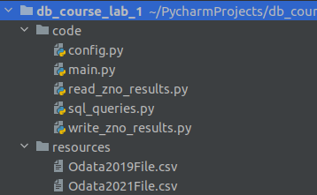

# How to prepare environment
1. Clone project from github
2. Create folder `resources` with 2 files `Odata2019File.csv` and `Odata2021File.csv`

# How to test the application
1. Open console in the same folder as a project
2. Execute command `docker-compose up`
3. Stop the container with application(db_lab_1_app) after a while
4. Start the container with application
5. Check that number of records in table `zno_results` is increasing
6. Wait while the program is processing files and its container will stop with code 0
7. Execute `select count(*)` and `select count(distinct id)` queries and compare results (they should be identical)